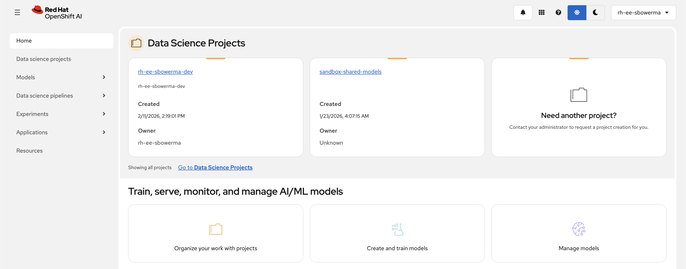
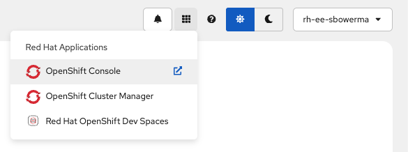

# Prerequisites

## Accounts and access
- Access to an **OpenShift AI 3.x** environment ([Red Hat Developer Sandbox](https://developers.redhat.com/developer-sandbox)).
- Permission to **create a Workbench** and **deploy a model** in your assigned project.
- **Outbound internet access** from the Workbench (needed to clone the repo and download MNIST data).



## Tools
- **[`oc` CLI](https://docs.redhat.com/en/documentation/openshift_container_platform/4.18/html/cli_tools/openshift-cli-oc)** — logged in to the cluster. You will use `oc` to upload the model to storage, create the serving runtime, and (optionally) create a Route.
- **OpenShift AI dashboard** — used to deploy the model to the serving platform.
- **`curl`** — only needed for the optional external test step.

## Log in with the `oc` CLI

You need to authenticate the `oc` CLI with your cluster. To get your login token:

1. Open the **OpenShift console** in your browser.

    

2. Click your username in the top-right corner and select **Copy login command**.
3. Click **Display Token** on the page that opens.
4. Copy the `oc login` command — it looks like this:

    ```bash
    oc login --token=sha256~XXXXX --server=https://api.<CLUSTER_DOMAIN>:443
    ```

5. Paste and run it in your terminal.

!!! note "Token expiration"
    Login tokens expire after a period of inactivity. If you see `error: the server has asked for the client to provide credentials`, repeat the steps above to get a fresh token.

## Values you will need (fill these in)
Create a sticky note with these items:

| Value | Example | Where it's used |
|-------|---------|-----------------|
| Cluster console URL | `https://console-openshift-console.apps...` | Accessing the UI |
| OpenShift AI dashboard URL | `https://rhods-dashboard...` | Workbench and model deployment |
| Your project name | `hello-world-nn` | All `oc` commands |
| Workshop Git repo URL | `https://github.com/rh-aiservices-bu/hello-world-NN` | Cloning into Workbench |

!!! note "Project name"
    In most sandbox environments, a project has already been created for you. Use the project name assigned to you — you will type it in `oc` commands throughout the lab. If you are unsure, ask your workshop staff.
