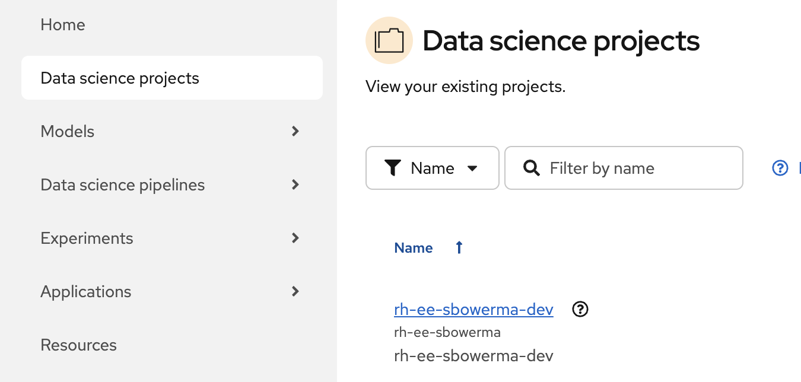
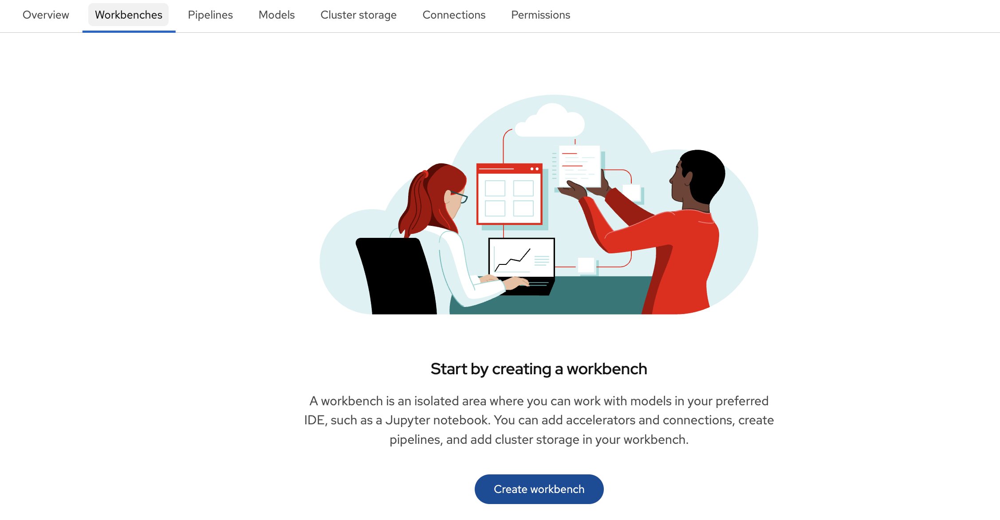
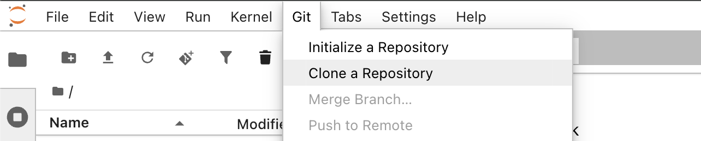
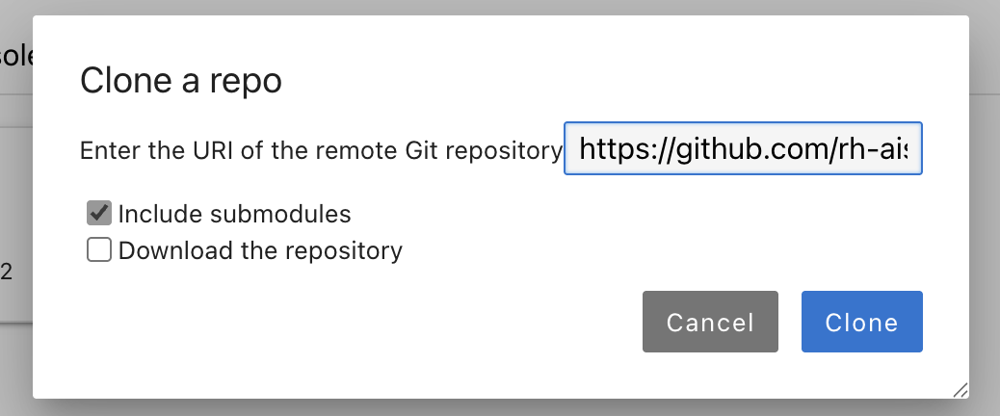
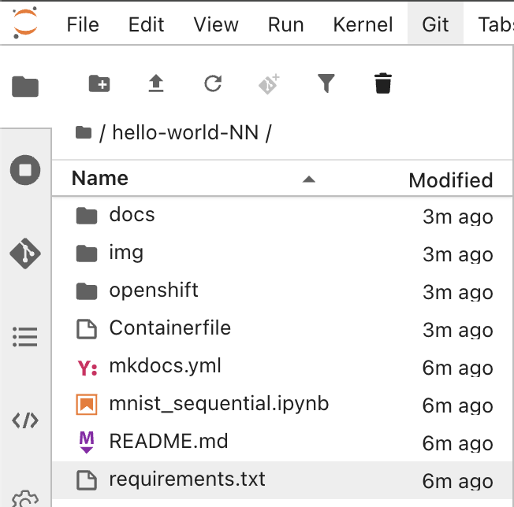

# Step 1 — Launch the Workbench (default PyTorch image)

## Goal
Start a Jupyter Workbench using the **default PyTorch notebook image** provided by OpenShift AI, then clone this workshop repository to get the notebook and assets.

## Why the default image?
OpenShift AI 3.x ships with curated notebook images (including a PyTorch image) that are ready to use. This avoids the need to build or import a custom image, which would require RBAC permissions most sandbox users do not have.

## Procedure (attendee)
1. In **OpenShift AI**, select your project.

    

    !!! note "Sandbox projects"
        In most sandbox environments, you cannot create your own project — one has been pre-assigned to you. Select the project that matches your assigned namespace. If you are unsure which project to use, ask your workshop staff.

2. Go to **Workbenches → Create workbench**.

    

3. Name it `mnist-workbench`.

4. For the notebook image, select **PyTorch | CUDA | 3.12** from the list of standard images provided by OpenShift AI.

    

    !!! note "Which PyTorch image?"
        There are several PyTorch images available. Choose the one labeled **PyTorch | CUDA | 3.12**. Despite the CUDA label, it works fine on CPU — CUDA support is optional and unused in this workshop.

5. For container size, the defaults are fine. The model is small (109K parameters) and trains comfortably on CPU.

6. Start the Workbench and open Jupyter.

7. In JupyterLab, clone the workshop repo using the GUI:
    - Click **Git → Clone a Repository** from the top menu bar.

        

    - Paste the repository URL:

        ```
        https://github.com/rh-aiservices-bu/hello-world-NN
        ```

    - Click **Clone**.

        

8. In the Jupyter file browser, navigate into the cloned repo folder. You should see:
    - `mnist_sequential.ipynb` — the training notebook
    - `img/` — images used by the notebook

    

## Success criteria
- Jupyter opens successfully using the default PyTorch image.
- The repo is cloned and you can see `mnist_sequential.ipynb` in the file browser.

## Troubleshooting
- **Workbench fails to start**: Check that you selected the correct PyTorch image from the standard images list. Confirm your project has enough resource quota.
- **Git clone fails in the UI**: If you see a network or authentication error, the sandbox may restrict outbound access. Ask your workshop staff for an alternative way to get the notebook files (e.g., direct file upload or a pre-populated PVC).
- **No "Git" menu in JupyterLab**: The Git extension should be pre-installed in the default PyTorch image. If it is missing, you can use **File → New → Terminal** and run `git clone https://github.com/rh-aiservices-bu/hello-world-NN` as a fallback.
