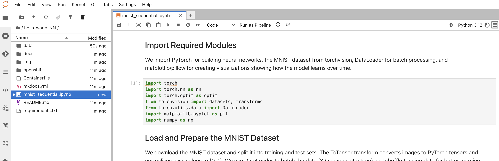
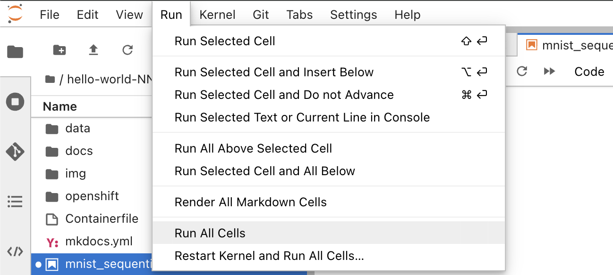
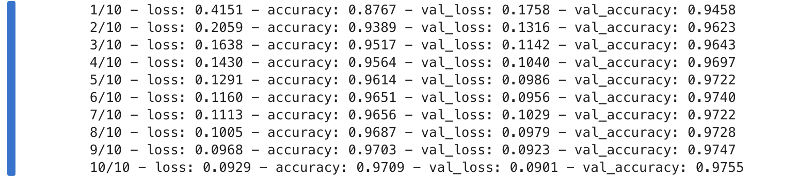
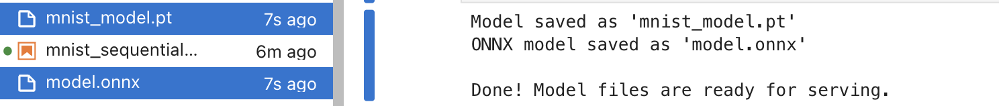

# Step 2 — Train the model and export to ONNX

## Goal
Run the provided `mnist_sequential.ipynb` notebook to:
- load the MNIST dataset
- train a small neural network on CPU
- export the model to **ONNX format** (`mnist_model.onnx`) for serving

## Why ONNX?
ONNX (Open Neural Network Exchange) is a portable model format supported by the **OpenVINO Model Server (OVMS)** runtime in OpenShift AI. Exporting to ONNX means your model can be served without needing the original PyTorch code.

!!! info "Why not serve the PyTorch `.pt` file directly?"
    We tested TorchScript (`.pt`) export with OVMS and it fails with `Could not find file for model` errors. OVMS converts all models to OpenVINO IR internally, and ONNX is the most reliable input format for this conversion. ONNX is also framework-agnostic, making it the better choice for production serving.

## Quick path (attendee)
1. In Jupyter, open `mnist_sequential.ipynb`.

    

2. Run the notebook top-to-bottom (**Run → Run All Cells** or use the run button for each cell).

    

    !!! note "First run downloads MNIST data"
        The first cell that loads the dataset will download ~12 MB of MNIST data from the internet. This requires outbound access from the Workbench. The download happens once and is cached in a `./data` directory.

3. Confirm you see:
   

   - The final cell saves two model files:
     - `mnist_model.pt` — PyTorch state dict (for reloading/retraining)
     - `mnist_model.onnx` — ONNX export (**this is what you will deploy for serving**)

        

## What "success" looks like
- Validation accuracy reaches **~97%** after 10 epochs.
- Both `mnist_model.pt` and `mnist_model.onnx` appear in the file browser.
- The model is **~430 KB** — small enough that no GPU is needed.

!!! warning "Remember this for the next step"
    The notebook saves the file as **`mnist_model.onnx`**, but OVMS expects the file to be named **`model.onnx`** inside a version directory (`1/`). You will rename it when uploading to storage in the next step.

## If you're curious: what is happening
- The model is a simple feedforward network: 784 → 128 → 64 → 10 (**109,386 parameters**).
- Dropout (30%) prevents overfitting on this small dataset.
- The ONNX export uses `torch.onnx.export()` with **opset 13** and dynamic batch size, meaning the served model can handle any batch size at inference time.
- The model input is a single-channel 28x28 grayscale image (shape `[batch, 1, 28, 28]`, values 0.0–1.0).
- The model output is 10 raw logits (shape `[batch, 10]`). The predicted digit is the index with the highest value.

## Common issues
- **Kernel dies / out of memory**: reduce batch size in the `DataLoader` cells (change `batch_size=32` to `batch_size=16`). The model should train comfortably with 512 MB.
- **MNIST download fails**: the Workbench needs outbound internet access. If blocked, ask your workshop staff to pre-populate the `./data` directory.
- **No output model created**: make sure you run the final "Save the Trained Model" cell — it's the last code cell in the notebook.
- **ONNX export warning**: you may see a `DeprecationWarning` about TorchScript-based export — this is safe to ignore. The ONNX file is still generated correctly.
