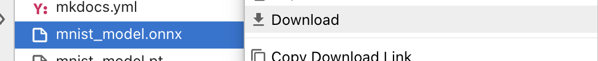
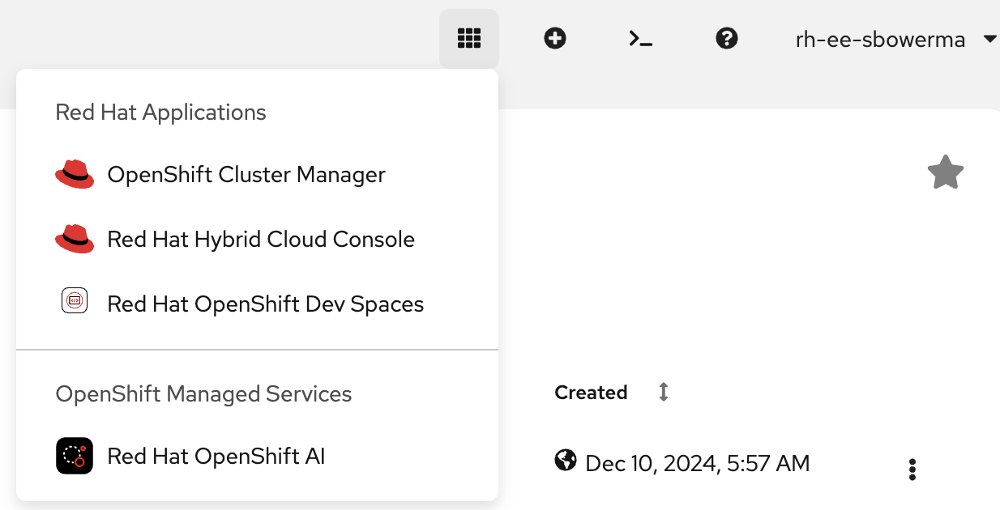
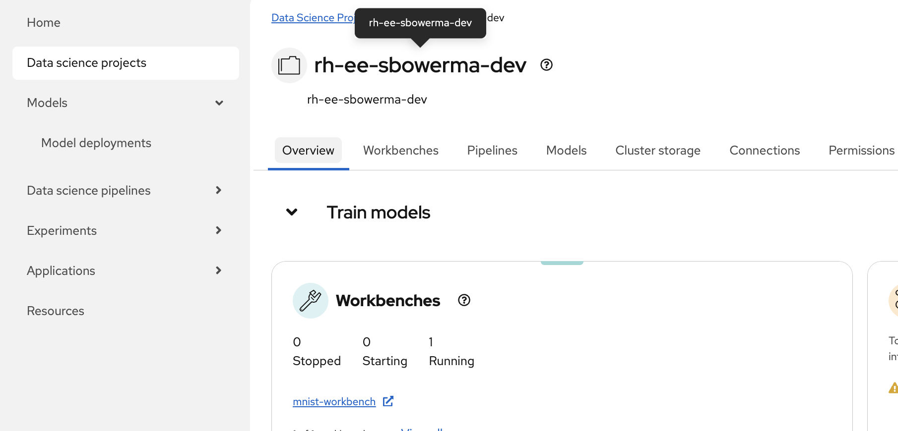

# Step 3 — Deploy to OpenShift AI model serving

## Goal
Upload your trained MNIST model to cluster storage, then deploy it through the **OpenShift AI dashboard** using the **OpenVINO Model Server (OVMS)** runtime.

## Mental model
```text
model.onnx (exported by the notebook)
  └─> Upload to PVC under 1/model.onnx via oc CLI
        └─> Deploy model through the OpenShift AI dashboard
              └─> OVMS runtime loads the model via KServe
                    └─> Two services are created:
                          ├─> mnist-onnx-predictor (headless, port 80 → 8888)
                          └─> mnist-onnx-metrics   (ClusterIP, port 8888)
                                └─> Route exposes port 8888 externally
```

- Your **ONNX model artifact** needs to be in a location the serving runtime can access (PVC or S3-compatible object storage).
- The **OVMS serving runtime** loads the model and exposes a **v2 inference API** on port **8888**.
- KServe creates **two services**: a headless predictor service and a metrics service. External Routes should target the **metrics service**.

## Procedure (attendee)

### 1. Download the model from the Workbench

In JupyterLab, locate the `model.onnx` file in the file browser. Right-click the file and select **Download** to save it to your laptop.



You will upload this file to cluster storage in the next step.

### 2. Upload the model to a PVC

OVMS expects the model file inside a **numbered version directory**. The final layout on the PVC must be:

```
mnist-model-pvc (PersistentVolumeClaim)
  └─ 1/
      └─ model.onnx
```

!!! danger "File naming is strict"
    OVMS will **crash with `File not found`** if:

    - The file is not named exactly `model.onnx`
    - There is no version directory (`1/`)
    - The file is placed directly at the PVC root without a version directory

    You may also see a harmless warning about `lost+found` if using a PVC — this can be ignored.

First, create the PVC:

```bash
cat <<EOF | oc apply -n <PROJECT_NAME> -f -
apiVersion: v1
kind: PersistentVolumeClaim
metadata:
  name: mnist-model-pvc
spec:
  accessModes:
    - ReadWriteOnce
  resources:
    requests:
      storage: 1Gi
EOF
```

Next, create a temporary helper pod that mounts the PVC so you can copy the model onto it:

```bash
cat <<EOF | oc apply -n <PROJECT_NAME> -f -
apiVersion: v1
kind: Pod
metadata:
  name: model-upload
spec:
  securityContext:
    fsGroup: 0
  containers:
  - name: upload
    image: registry.access.redhat.com/ubi9/ubi:latest
    command: ["sh", "-c", "mkdir -p /mnt/models/1 && sleep 3600"]
    volumeMounts:
    - name: model-storage
      mountPath: /mnt/models
  volumes:
  - name: model-storage
    persistentVolumeClaim:
      claimName: mnist-model-pvc
  restartPolicy: Never
EOF
```

!!! info "Why `fsGroup: 0`?"
    PVC volumes are initially root-owned, but pods in OpenShift run as a random non-root UID. Setting `fsGroup: 0` tells Kubernetes to make the volume group-writable, so the pod can create directories and files without needing root privileges.

Wait for the pod, copy the model, then clean up:

```bash
# Wait for the pod to be ready
oc wait pod/model-upload -n <PROJECT_NAME> --for=condition=Ready --timeout=120s

# Copy model.onnx into the version directory on the PVC
oc cp model.onnx <PROJECT_NAME>/model-upload:/mnt/models/1/model.onnx -c upload

# Verify the file is in place
oc exec model-upload -n <PROJECT_NAME> -c upload -- ls -la /mnt/models/1/

# Delete the upload pod to release the PVC
oc delete pod model-upload -n <PROJECT_NAME>
```

!!! warning "Delete the upload pod before deploying"
    The PVC uses `ReadWriteOnce`, which means only one pod can mount it at a time. **You must delete the upload pod before the serving pod can start.** If you see a `Multi-Attach error`, this is why.

### 3. Create the serving runtime

Before you can deploy the model through the dashboard, you need an OVMS serving runtime in your project. Create it from the cluster template:

```bash
oc process kserve-ovms -n redhat-ods-applications | \
  oc apply -n <PROJECT_NAME> -f -
```

Verify it was created:

```bash
oc get servingruntime -n <PROJECT_NAME>
```

Expected output:

```
NAME          AGE
kserve-ovms   5s
```

### 4. Deploy the model through the OpenShift AI dashboard

Now use the dashboard UI to deploy the model.

1. Open the **OpenShift AI dashboard** in your browser. You can find the URL from the OpenShift console's application launcher (grid icon in the top-right), or ask your workshop staff for the link.

    

2. In the left menu, click **Data Science Projects**. Find and click your project name (`<PROJECT_NAME>`).

    

3. Click the **Models** tab. You should see the single-model serving platform available. Click **Deploy model**.

    
    <!-- TODO (workshop author): Replace with a screenshot of the Models tab showing the Deploy model button -->

4. Fill in the deployment form:

    | Field | Value |
    |-------|-------|
    | **Model deployment name** | `mnist-onnx` |
    | **Model type** | Predictive AI |
    | **Serving runtime** | OpenVINO Model Server |
    | **Model framework** | onnx - 1 |
    | **Deployment mode** | Standard (RawDeployment) |
    | **Model location** | Cluster storage — select `mnist-model-pvc` |
    | **Model route** | Check the box to make the model available externally |

    
    <!-- TODO (workshop author): Replace with a screenshot of the deploy model form with all fields filled in as described above -->

    !!! info "Model location"
        Select **Cluster storage** from the model location dropdown. Choose the `mnist-model-pvc` PVC you created in step 2. The model path should point to the root of the PVC (the version directory `1/model.onnx` is already in the correct layout).

    !!! note "Model route"
        Checking the **Make deployed models available through an external route** option creates a Route automatically so you can access the inference endpoint from outside the cluster. If this option is not available, you can create the Route manually (see step 6 below).

5. Click **Deploy**. The dashboard will create the InferenceService and begin deploying the model.

### 5. Verify the deployment in the dashboard

After clicking Deploy, the dashboard shows the model's deployment status.

1. On the **Models** tab, watch for the status to change to a green checkmark indicating the model is **Loaded** and ready.

    
    <!-- TODO (workshop author): Replace with a screenshot of the model deployment list showing a green/ready status -->

2. You can also verify from the CLI:

    ```bash
    oc get inferenceservice mnist-onnx -n <PROJECT_NAME>
    ```

    Expected output:

    ```
    NAME         URL                                                                READY
    mnist-onnx   http://mnist-onnx-predictor.<PROJECT_NAME>.svc.cluster.local       True
    ```

3. Check the serving pod logs to confirm the model loaded:

    ```bash
    oc logs -l serving.kserve.io/inferenceservice=mnist-onnx -n <PROJECT_NAME> --tail=10
    ```

    You should see output like:

    ```
    Loading model: mnist-onnx, version: 1, from path: /mnt/models/1, with target device: CPU ...
    Input name: input; mapping_name: input; shape: (-1,1,28,28); precision: FP32; layout: N...
    Output name: output; mapping_name: output; shape: (-1,10); precision: FP32; layout: N...
    Loaded model mnist-onnx; version: 1; batch size: -1; No of InferRequests: 1
    STATUS CHANGE: Version 1 of model mnist-onnx status change. New status: ( "state": "AVAILABLE", "error_code": "OK" )
    ```

### 6. Create an external Route (if needed)

If you checked the **model route** option in the deploy form, a Route was created automatically — skip to the next step.

If no Route was created, create one manually. Target the **metrics service** (not the predictor service):

```bash
oc create route edge mnist-onnx-inference \
  --service=mnist-onnx-metrics \
  --port=8888 \
  -n <PROJECT_NAME>
```

!!! warning "Why `mnist-onnx-metrics` and not `mnist-onnx-predictor`?"
    KServe creates two services:

    | Service | Type | Port mapping |
    |---------|------|-------------|
    | `mnist-onnx-predictor` | Headless (ClusterIP: None) | 80 → 8888 |
    | `mnist-onnx-metrics` | ClusterIP | 8888 → 8888 |

    The predictor service is headless, which means Routes and port-forwards don't work reliably against it. Always use the **metrics service** for external access and port-forwarding.

Get the Route URL:

```bash
oc get route mnist-onnx-inference -n <PROJECT_NAME> -o jsonpath='{.spec.host}'
```

## What "success" looks like
- The dashboard shows the model as **Loaded** with a green status.
- The InferenceService shows `READY=True` in the CLI.
- The serving pod is `Running` with **no restarts**.
- Logs confirm the model loaded as `AVAILABLE` and show the correct input/output shapes.
- The Route exists and returns the model metadata when accessed.

## Common issues
- **Helper pod fails with SCC error**: if the `model-upload` pod is rejected with a security context constraint error, verify you are using the pod spec from these instructions (no `runAsUser: 0` or privileged settings).
- **Pod stuck in `ContainerCreating`**: check if the PVC is still attached to the upload pod. Delete it first: `oc delete pod model-upload -n <PROJECT_NAME>`.
- **CrashLoopBackOff — "File not found"**: the directory layout is wrong. Verify `1/model.onnx` exists on the PVC.
- **`lost+found` warning in logs**: harmless — PVC formatting creates this directory. OVMS logs a warning but continues normally.
- **Image pull errors**: the OVMS image is pulled from `registry.redhat.io` and requires valid Red Hat pull credentials on the cluster.
- **Model not appearing in dashboard**: make sure your namespace has the label `opendatahub.io/dashboard=true`. Add it with: `oc label namespace <PROJECT_NAME> opendatahub.io/dashboard=true`.
